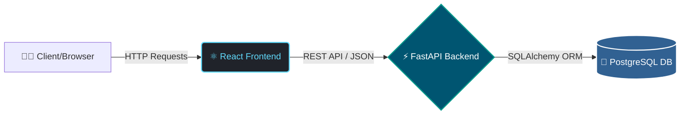

# 🚀 Nexus OS | Enterprise Inventory & Order Management


A highly optimized, full-stack, and fully containerized Inventory and Order Management System. Designed strictly according to the assessment instructions, it enforces business constraints (inventory validation, unique SKUs, automated stock deductions) while providing a premium, responsive user experience.

---

## 🌍 Live Environments & Links
> **Note to Evaluator:** The backend is hosted on a free Render instance. It spins down after inactivity, so the **very first API call might take 30-50 seconds** to wake up.

- **Frontend Application (Vercel):** [https://nexus-inventory-orcin.vercel.app/](https://nexus-inventory-orcin.vercel.app/)
- **Backend API (Swagger UI):** [https://nexus-inventory-7t9p.onrender.com/docs](https://nexus-inventory-7t9p.onrender.com/docs)
- **GitHub Repository:** [https://github.com/Bipin18-git/nexus-inventory](https://github.com/Bipin18-git/nexus-inventory)
- **Docker Setup:** Handled natively via the provided `docker-compose.yml` (multi-container orchestrated setup).

---

## 🏗️ System Architecture & Data Flow

The application follows a modern decoupled architecture. Below is the automated data flow:



### 📂 Directory Structure
```text
📦 nexus-inventory
 ┣ 📂 frontend               # React + Vite + Tailwind CSS
 ┃ ┣ 📂 src                  # UI Components, Axios API calls, State Management
 ┃ ┣ 📜 Dockerfile           # Multi-stage Docker build for React
 ┃ ┗ 📜 package.json         
 ┣ 📂 backend                # FastAPI + Python
 ┃ ┣ 📜 main.py              # API Routes & Business Logic
 ┃ ┣ 📜 requirements.txt     # Python Dependencies
 ┃ ┗ 📜 Dockerfile           # Uvicorn/FastAPI Docker setup
 ┣ 📜 docker-compose.yml     # Orchestrates Frontend, Backend, and Postgres DB
 ┗ 📜 README.md              # Documentation
```

---

## ✨ Implemented Business Rules & Premium UI/UX

### 🛡️ Business Constraints Handled (Backend Validations):
1. **Product Management:** Enforces **Unique SKUs**. Duplicate SKU attempts return a structured HTTP 400 error.
2. **Customer Directory:** Enforces **Unique Email Addresses** per customer.
3. **Inventory Validation:** Orders cannot be placed if the requested quantity exceeds the available `stock_quantity`.
4. **Automated Stock Reduction:** Upon a successful order transaction, the product's stock is automatically reduced in the database.

### 🎨 Premium UI/UX Details:
- **Modern SaaS Aesthetics:** Utilizing Tailwind CSS for clean borders, shadows, and spacing.
- **Custom Toast Notifications:** Eliminated native browser alerts in favor of animated, professional toast popups.
- **Dynamic Status Badges:** Automated conditional rendering (e.g., Red "Low Stock" badges if quantity is 10 or below).

---

## 🗄️ Database Schema Overview
The PostgreSQL database consists of 3 strictly relational tables:
- `products`: `id` (PK), `sku` (Unique, Indexed), `name`, `price`, `stock_quantity`.
- `customers`: `id` (PK), `name`, `email` (Unique, Indexed).
- `orders`: `id` (PK), `customer_id` (FK), `product_id` (FK), `quantity`, `order_date`.

---

## 📡 Core API Reference

| Method | Endpoint | Description |
| :--- | :--- | :--- |
| `GET` | `/products/` | Fetch all inventory items and stock status. |
| `POST` | `/products/` | Create a new product (Enforces Unique SKU). |
| `GET` | `/customers/` | Fetch all registered customers. |
| `POST` | `/customers/` | Register a new customer (Enforces Unique Email). |
| `POST` | `/orders/` | Process a transaction & auto-deduct stock. |

---

## 💻 Local Developer Setup (Docker)

Running this project locally requires zero manual configuration of databases or environments. 

**Prerequisites:** [Docker Desktop](https://www.docker.com/products/docker-desktop) installed.

### 1. Clone the repository
```bash
git clone [https://github.com/Bipin18-git/nexus-inventory.git](https://github.com/Bipin18-git/nexus-inventory.git)
cd nexus-inventory
```

### 2. Set up Environment Variables
Create a `.env` file inside the `backend` folder:
```env
DATABASE_URL=postgresql://admin:password@db:5432/inventory_db
```

### 3. Fire up the infrastructure
Run the following command in the root directory:
```bash
docker compose up --build
```

**Local Access Points:**
- **Frontend UI:** `http://localhost:5173`
- **API Swagger Docs:** `http://localhost:9090/docs`
- **PostgreSQL Database:** `localhost:5432`

---

## ✅ Assessment Fulfillment Checklist

- [x] **Backend API:** Built with Python & FastAPI.
- [x] **Frontend:** Built with React & Tailwind CSS.
- [x] **Database:** PostgreSQL integration for relational integrity.
- [x] **Business Rules:** Strict inventory validation and SKU/Email constraints implemented.
- [x] **Containerization:** Complete `Dockerfile` (frontend/backend) and `docker-compose.yml` setup.
- [x] **Environment Variables:** Secure credential management used (no hardcoded credentials).
- [x] **Deployment:** Fully accessible via public URLs (Vercel & Render).
- [x] **GitHub & Docker Details:** Repository and containerization provided.

---
*Architected and developed by Bipin Kumar for technical assessment evaluation.*
